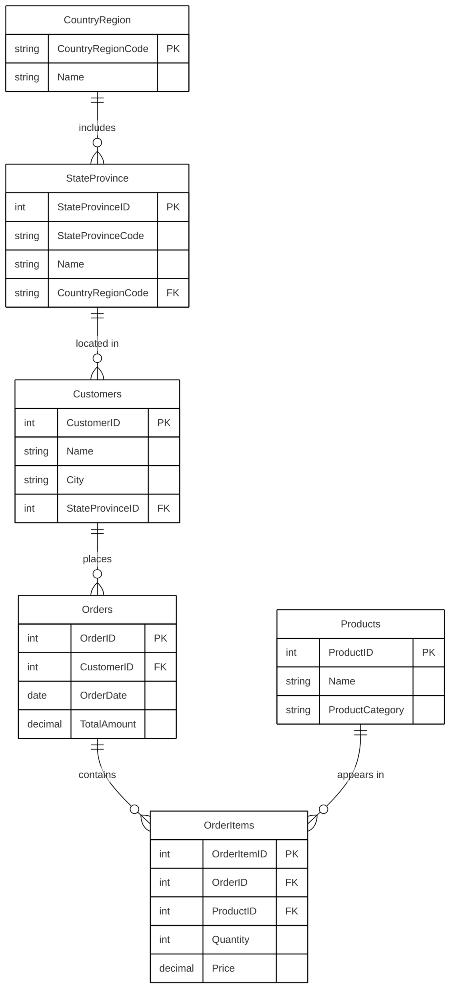

<<<<<<< HEAD
# README

## Overview

This repo is the companion to my [SQL Query Performance Pipeline]() video on YouTube.

If you’re following along in the video, this is the exact demo environment I use — the same tables, the same queries, the same indexing steps.

The repo includes two main parts: scripts to build the demo database and queries used throughout the chapters.
It contains the following:

<caption>Scripts</caption>

| Item                               | Description                                                                 |
|------------------------------------|-----------------------------------------------------------------------------|
| KimberlyEmersonDemos__CREATE.sql   | Script to easily create the demo database using `SELECT...INTO` from AdventureWorks2025     |
| KimberlyEmersonDemos__Indexing.sql | Script to create indexes for the demo database                              |

<caption>Queries</caption>

| Item                        | Description                                      |
|-----------------------------|--------------------------------------------------|
| usecase_Predicates.sql      | Query to be used in the Predicates chapter       |
| usecase_Estimates_Hash.sql  | Query to be used in the Estimates and Indexes chapters |
| usecase_Estimates_Merge.sql | Query to be used in the Join Order chapter       |

Throughout the video, on‑screen prompts will tell you exactly which query to open and when.

## Requirements

Before running any scripts, make sure your environment is fully set up.

This demo assumes you already have SQL Server installed, SSMS ready to go, and the AdventureWorks2025 sample database restored.

If any of these pieces are missing, the scripts won’t run — so verify your setup first.

| Requirement                       | Status     |
|-----------------------------------|------------|
| SQL Server (latest version)       | Installed  |
| SQL Server Management Studio      | Installed  |
| AdventureWorks2025 Database       | Installed  |

Once everything is in place, you’re ready to create the demo database and start exploring how SQL Server actually makes decisions inside the query performance pipeline.

### SQL Server and AdventureWorks2025 Database

If you need some help installing SQL Server or restoring the AdventureWorks2025 Database, I have a video for you.

**Watch the setup guide:**
[Setup SQL Server Like a PRO](https://youtu.be/vId1ZT7mZN8?si=wHCHf3DAi-hKwCqK)

In this video, I walk through:

✅ Step-by-step SQL Server installation using command-line efficiency  
✅ Essential configuration for optimal performance  
✅ Visual Studio Code & SSMS setup with pro-level customizations  
✅ Sample database restoration
✅ Security best practices and user setup  

### SQL Server Management Studio

SSMS is the main tool we’ll use to connect to SQL Server, run the demo queries, and inspect execution plans.

If you’re on Windows, the fastest install method is winget. Open PowerShell and run:

```powershell
winget install --id Microsoft.SQLServerManagementStudio.22 --source winget
```

This installs the latest version automatically.

If you already use Visual Studio, you can also install SSMS through the Visual Studio Installer by enabling the Data storage and processing workload.

Once SSMS is installed, you’re ready to connect to your instance and load the demo database.

### Entity Relationship Diagram




=======
# sql-query-performance-pipeline
>>>>>>> 9141f02b40d6df4877a6634953e782c15e1eb099
